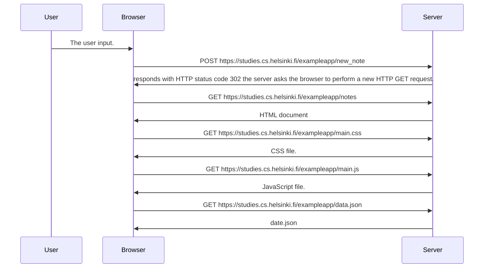

```mermaid
sequenceDiagram
    participant User
    participant Browser
    participant Server

    User->>Browser:The user input.
    Browser->>Server:POST https://studies.cs.helsinki.fi/exampleapp/new_note
    Server->>Browser:responds with HTTP status code 302 the server asks the browser to perform a new HTTP GET request.
    Browser->>Server:GET https://studies.cs.helsinki.fi/exampleapp/notes
    Server->>Browser:HTML document
    Browser->>Server:GET https://studies.cs.helsinki.fi/exampleapp/main.css
    Server->>Browser: CSS file.
    Browser->>Server:GET https://studies.cs.helsinki.fi/exampleapp/main.js
    Server->>Browser: JavaScript file.
    Browser->>Server:GET https://studies.cs.helsinki.fi/exampleapp/data.json
    Server->>Browser: date.json
```